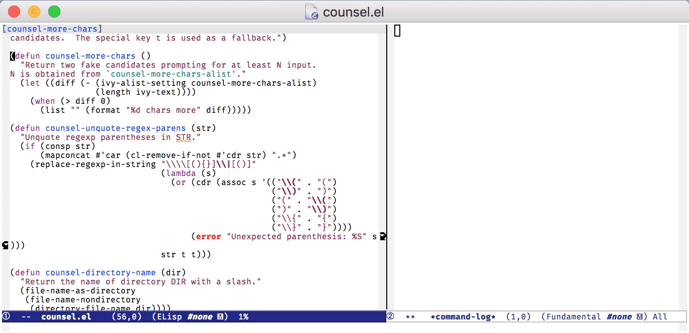
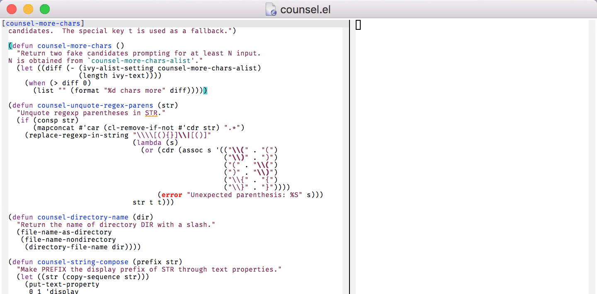

# Sticky Region

Ever wanted to run multiple commands on a region, but the first command clears the region?  sticky-region make the region "sticky", which means it stays active across commands.

Here's an example with `query-replace`, which deactivates the mark and moves point when it exits.  After the region is cleared, I invoke `sticky-region-activate` (<kbd>C-x C-z</kbd>), which reactivates my last region, and keeps it active across successive commands until I clear the region with <kbd>C-g</kbd>.



sticky-region also keeps a history of past regions, which you can recall with successive presses to <kbd>C-z</kbd> after the first.




## Installation

sticky-region isn't yet on MELPA.  For now I recommend [downloading it](https://github.com/dsedivec/sticky-region/raw/master/sticky-region.el), dropping it somewhere Emacs will find it.


## Usage

Turn on `sticky-region-mode`:

``` emacs-lisp
(require 'sticky-region)
(sticky-region-mode 1)
```

`sticky-region-mode` is a global minor mode.  Once it is enabled, use <kbd>C-x C-z</kbd> (`sticky-region-activate`) to make the current region sticky, or to bring back your last region and make it sticky.  Then execute commands as normal.  You can clear the sticky region with <kbd>C-g</kbd>.

If you give `sticky-region-activate` a prefix argument, it will try and pop the next region from its history, forgetting the current region, if any.

After pressing <kbd>C-x C-z</kbd> once, you can keep hitting <kbd>C-z</kbd> to go further back in your history of regions.

Region history and stickiness is per-buffer.


## Configuration

You can change the binding for `sticky-region-activate` in `sticky-region-mode-map`.  For example, to rebind it to <kbd>s-s</kbd>:

``` emacs-lisp
(define-key sticky-region-mode-map (kbd "C-x C-z") nil)
(define-key sticky-region-mode-map (kbd "s-s") 'sticky-region-activate)
```

Change `sticky-region-history-size` if you want to keep more/less history of regions in each buffer.  It defaults to 20.


## Bugs and Feedback

If you find problems or have other suggestions, please open an issue, pull request, or email <dale@codefu.org>.
